# ECG-Screen-Extractor 🫀

[](https://choosealicense.com/licenses/mit/)
[](https://www.python.org/)
[](https://opencv.org/)
[](https://numpy.org/)

Computer vision project for extracting 12-lead ECG signals from screen captures and photographs or scans of paper ECG records.

The application detects ECG channel bands and baselines, reconstructs each waveform using Viterbi-style dynamic programming, rescales the horizontal axis to milliseconds, interpolates the result to 1000 Hz, saves the extracted signals as CSV files, and estimates the average heart rate in BPM.

The solution uses classical image-processing methods and does not rely on machine learning or neural networks.


## Requirements

This project was developed and tested with `Python 3.14.3`.

All required Python packages are listed in `requirements.txt`.

## Usage

Install the dependencies:

```bash
pip install -r requirements.txt
```

### Screen-capture mode

The default mode processes screen captures:

```bash
python main.py --input_dir input --output_dir output
```

### Photograph or scan mode

To process photographs or scans of paper ECG records:

```bash
python main.py --input_dir input_scan --output_dir output --mode scan
```

The program processes the supported image files from the selected input directory and saves CSV files and diagnostic visualizations in the output directory.

### Reconstructing a Signal from CSV 

To generate visualizations from extracted CSV files, run:

```bash 
python reconstruct.py --input_dir output
```

<details>
<summary><strong>How It Works</strong></summary>

## Input Modes

### Screen Captures

Screen captures have a stable layout, high contrast, and relatively little noise.

An example of the original screen capture is shown below: 

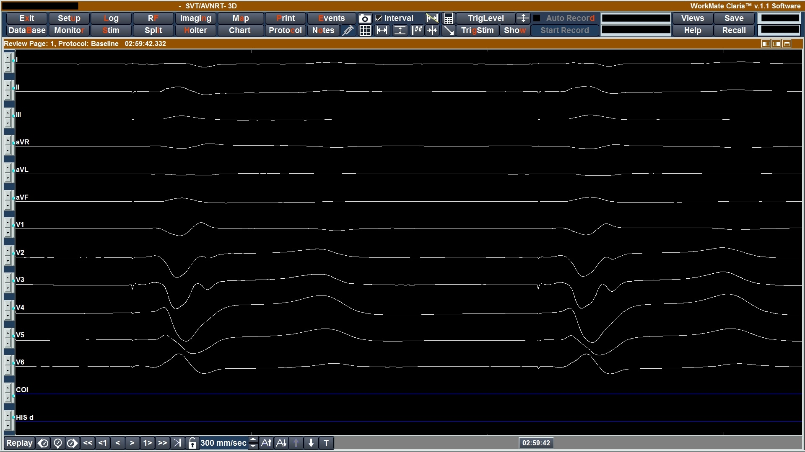

Because the ECG plotting area always appears in the same location, fixed crop coordinates are used to remove interface elements and retain only the waveform region.

The processing pipeline:

1. crops the ECG plotting area,
2. converts the image to grayscale,
3. applies global thresholding,
4. removes the left margin containing channel labels,
5. counts white pixels in every image row and smooths the resulting row-wise values, 
6. detects local maxima corresponding to the 12 ECG baselines, 
7. extracts each channel independently.

The detected baseline candidates are shown on the histogram of white-pixel counts for each image row:

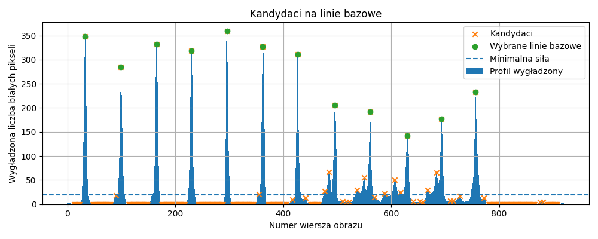

The final detected baselines are shown below:

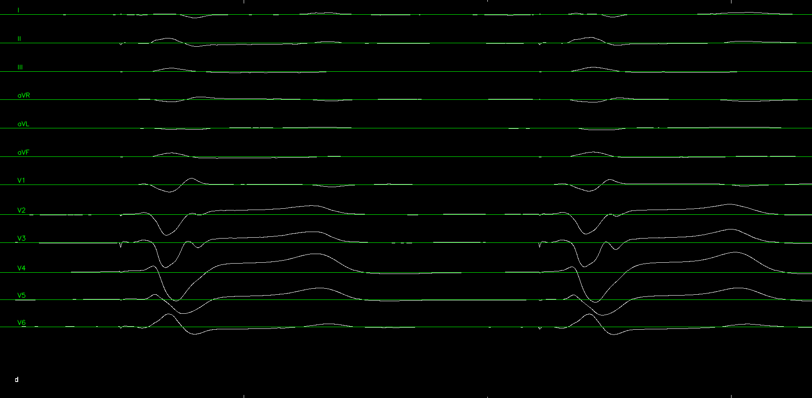

### Photographs and Scans

Real photographs may contain shadows, uneven illumination, paper curvature, perspective distortion, text, and a visible ECG grid.

The preprocessing pipeline:

1. estimates the background using Gaussian blur,
2. normalizes the grayscale image by the estimated background,
3. inverts and thresholds the image,
4. applies morphological opening to remove small artifacts.

The preprocessing stages are shown below:

<table>
  <tr>
    <td align="center">
      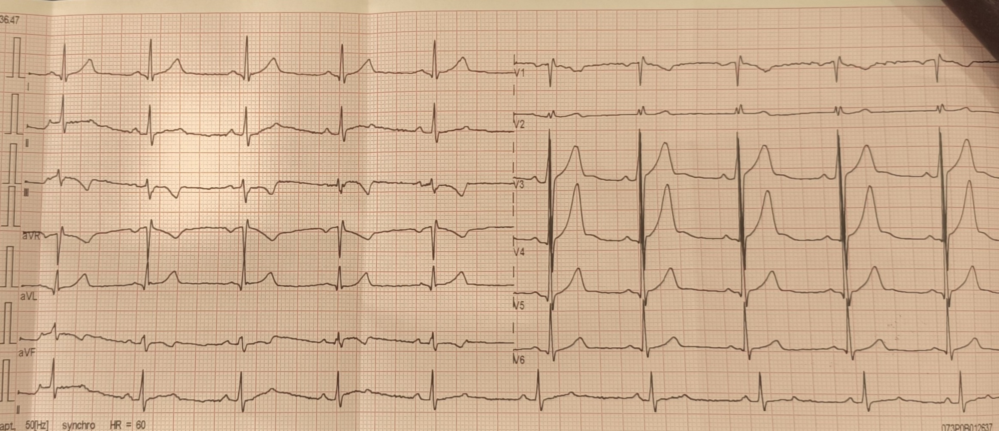<br>
      <sub>Original photograph</sub>
    </td>
    <td align="center">
      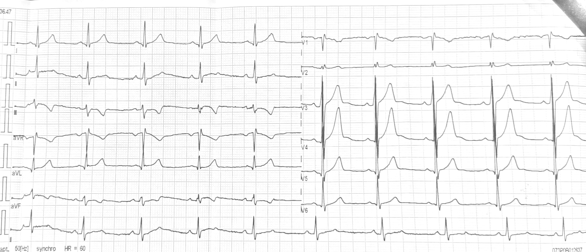<br>
      <sub>Illumination normalization</sub>
    </td>
  </tr>
  <tr>
    <td align="center">
      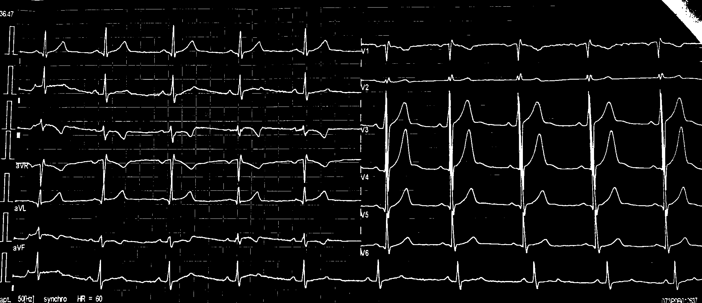<br>
      <sub>Thresholded signal mask</sub>
    </td>
    <td align="center">
      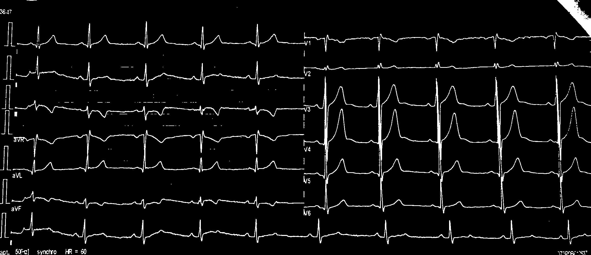<br>
      <sub>Morphological opening</sub>
    </td>
  </tr>
</table>

After preprocessing, the image is divided into left and right regions. Six ECG channel bands are detected independently in each region.

For every image row, the algorithm counts the number of white pixels belonging to the signal mask. The resulting row-wise values are smoothed and normalized. Dynamic programming then selects six ordered channel positions while considering:

- signal activity in the selected row,
- spacing between consecutive channels,
- distance from the expected channel position,
- minimum and maximum allowed spacing.

The selected rows are treated as channel baselines. The boundaries of individual channel bands are placed halfway between neighboring baselines.

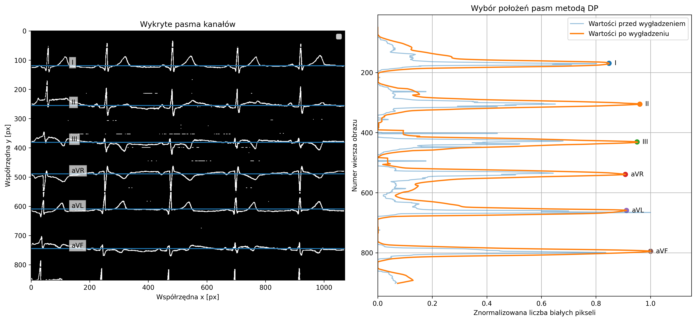


## Viterbi Waveform Extraction

Continuous vertical runs of white pixels in each image column are treated as waveform candidates.

For every candidate, the algorithm stores:

- the top and bottom boundaries of the vertical pixel run,
- the center of the run,
- the point representing the possible waveform position.

For short vertical runs, the center is used as the representative trace point. For tall runs, such as steep QRS complexes, the endpoint farther from the baseline is selected. This preserves the height of rapid waveform changes instead of placing the path in the center of a long vertical segment. 

The image below illustrates the candidate-detection process in selected columns. Red points indicate representative candidate positions, while the light-blue line marks the currently analyzed column. 

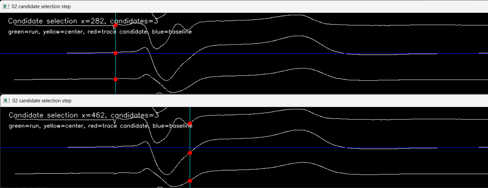 

After processing all columns, the algorithm obtains a set of possible candidate points distributed across the entire channel band:

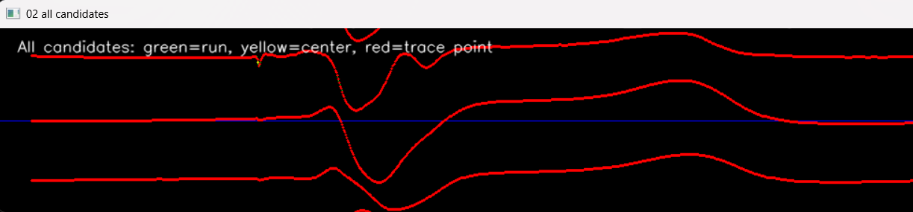

The candidates detected in consecutive columns are treated as states connected by possible transitions. Each transition is assigned a cost describing how well it follows a continuous ECG waveform.

The transition cost from candidate \(i\) to candidate \(j\) is defined as:

$$C_{ij} = w_g g_{ij} + w_s \frac{\left|y_j-y_i\right|}{\Delta x} + w_m(\Delta x-1) + w_b\left|c_j-y_b\right|.$$

The individual terms have the following meaning:

- \(g_{ij}\) — the smallest vertical distance between the pixel runs forming candidates \(i\) and \(j\). If their vertical intervals overlap or touch, then \(g_{ij}=0\).
- \(y_i\) and \(y_j\) — the vertical positions of the representative trace points of candidates \(i\) and \(j\).
- \(\Delta x\) — the horizontal distance between the columns containing the candidates.
- \(c_j\) — the center of the current candidate.
- \(y_b\) — the channel baseline position.
- \(w_g\), \(w_s\), \(w_m\), and \(w_b\) — weights controlling the influence of the individual cost components.

> The first component: $w_g g_{ij}$, penalizes vertical gaps between candidate intervals and reduces transitions to unrelated waveform fragments or image artifacts.
> 
> The second component: $w_s \frac{\left|y_j-y_i\right|}{\Delta x}$, describes the path slope. Smooth changes receive a lower cost, while rapid vertical jumps increase the transition cost.
> 
> The third component: $w_m(\Delta x-1)$, penalizes columns without detected candidates. Its value is zero for candidates located in neighboring columns, where \(\Delta x=1\).
> 
> The fourth component: $w_b\left|c_j-y_b\right|$, penalizes candidates located far from the channel baseline. This helps reject fragments belonging to neighboring channels, text, grid lines, or other artifacts.

For every candidate, the algorithm calculates not only the local transition cost but also the accumulated cost of the entire path leading to that candidate:

$$D_j = \min_i \left(D_i + C_{ij}\right),$$

> where \(D_i\) is the lowest accumulated cost of a path ending at candidate \(i\), and \(C_{ij}\) is the transition cost from candidate \(i\) to candidate \(j\).

The predecessor producing the lowest accumulated cost is stored for every candidate. Therefore, the algorithm keeps multiple possible paths instead of making an irreversible decision based only on the locally closest point.

<details>
<summary>Show dynamic-programming progression</summary>

The following images show how the best partial path changes as additional columns are processed.

### Initial dynamic-programming stage

At this stage, the algorithm evaluates the first available candidates and stores the lowest-cost partial paths.

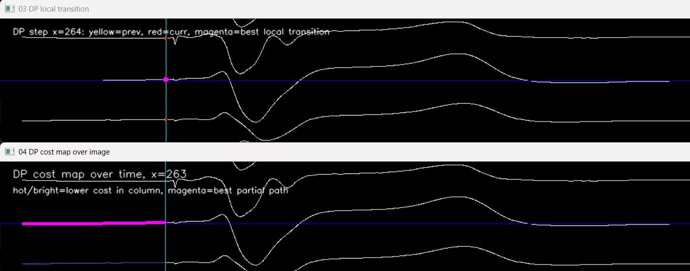

### Updated best partial path

After processing additional columns, another candidate sequence may obtain a lower accumulated cost, causing the currently best partial path to change.

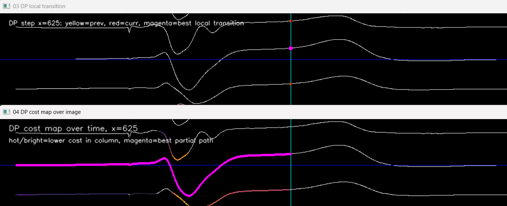

### Later dynamic-programming stage

The algorithm continues comparing accumulated path costs as further columns are processed.

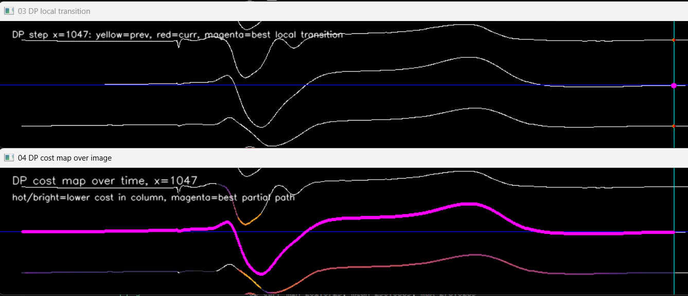

</details>

After all valid columns have been processed, all possible endpoints are evaluated. Each complete path is reconstructed by backtracking through the stored predecessors. The path with the lowest final cost is selected as the extracted ECG waveform.

Columns without detected candidates are filled using linear interpolation. Before the first and after the last detected point, the nearest edge value is preserved.

The final reconstructed waveform for a single channel is shown below:

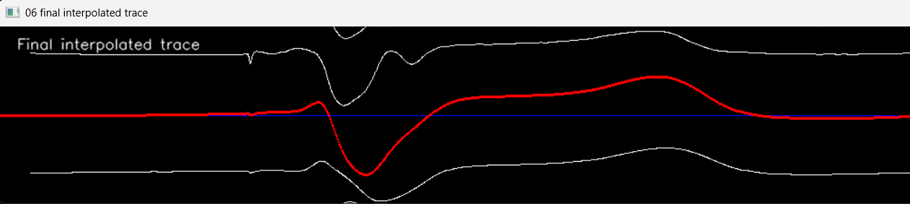


## Time Scaling and Interpolation

For screen captures, the horizontal scale is determined from a reference interval corresponding to `200 ms`.

For paper ECG photographs, the grid period is estimated from its repeating vertical structure. Assuming a paper speed of `25 mm/s`, one small ECG-grid square corresponds to `40 ms`.

Each extracted waveform is then interpolated onto a shared time axis with a `1 ms` step, corresponding to a sampling rate of `1000 Hz`.

## BPM Estimation

The average heart rate is estimated from detected R peaks.

For every channel, the program:

1. removes slow baseline drift using a moving average,
2. smooths the signal,
3. reverses the polarity when negative peaks dominate,
4. detects local maxima above a dynamic threshold,
5. enforces a minimum distance between consecutive peaks,
6. calculates valid R–R intervals,
7. converts the mean R–R interval to BPM.

Channel-level estimates that differ significantly from the median are rejected. The final result is calculated from the remaining consistent channels.

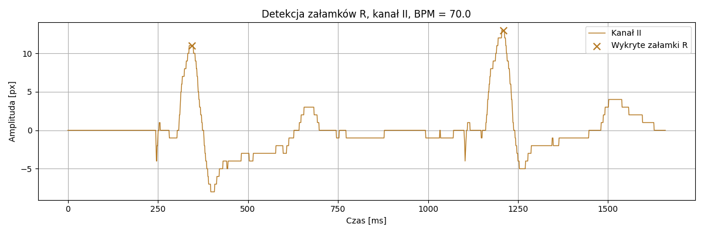

</details>


## Output Data

Each processed image produces a CSV file with the following columns:

```text
time_ms,I,II,III,aVR,aVL,aVF,V1,V2,V3,V4,V5,V6
```

* `time_ms` contains the shared time axis in milliseconds.
* The remaining columns contain the extracted amplitudes for all 12 ECG leads.
* Consecutive rows represent samples spaced `1 ms` apart.
* If one channel is shorter than the longest extracted waveform, its missing final samples are filled with zeros.

Amplitude is represented as the signed vertical distance from the detected baseline:

$$\mathrm{amplitude}_{\mathrm{px}} = y_{\mathrm{baseline}} - y_{\mathrm{trace}}$$

Positive values represent upward deflection relative to the baseline, while negative values represent downward deflection.

> The amplitude remains expressed in pixels and cannot be interpreted directly as millivolts without additional calibration.

An example input screen capture is shown below:


The extracted waveforms for all 12 ECG leads are shown below:

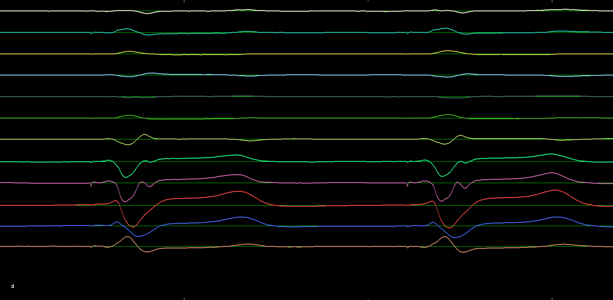

The reconstructed signal plotted directly from the saved CSV file is shown below: 

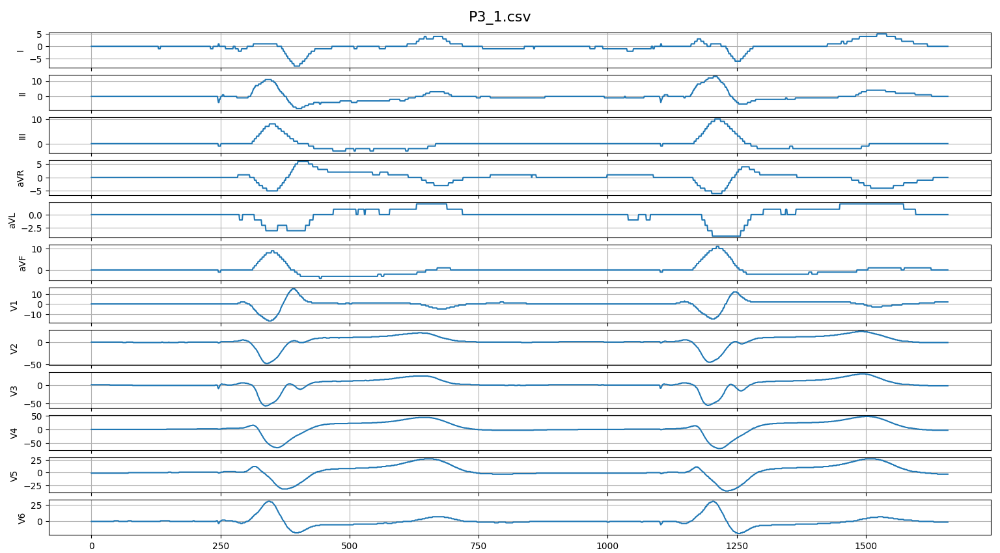

The estimated BPM value is printed in the terminal for each processed image.

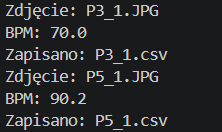

## References and Inspiration

The use of dynamic programming and the Viterbi algorithm was inspired by the following publications:

1. P. F. Felzenszwalb and R. Zabih, **“Dynamic Programming and Graph Algorithms in Computer Vision,”** *IEEE Transactions on Pattern Analysis and Machine Intelligence*, vol. 33, no. 4, pp. 721–740, 2011.  
   DOI: [`10.1109/TPAMI.2010.135`](https://doi.org/10.1109/TPAMI.2010.135)

2. J. D. Fortune, N. E. Coppa, K. T. Haq, H. Patel, and L. G. Tereshchenko, **“Digitizing ECG Image: A New Method and Open-Source Software Code,”** *Computer Methods and Programs in Biomedicine*, vol. 221, article 106890, 2022.  
   DOI: [`10.1016/j.cmpb.2022.106890`](https://doi.org/10.1016/j.cmpb.2022.106890)

The candidate representation, transition-cost function, channel-band detection, and implementation were developed independently for this project.


## 📜 License

This project is licensed under the **MIT License**. See the [LICENSE](LICENSE) file for details.
